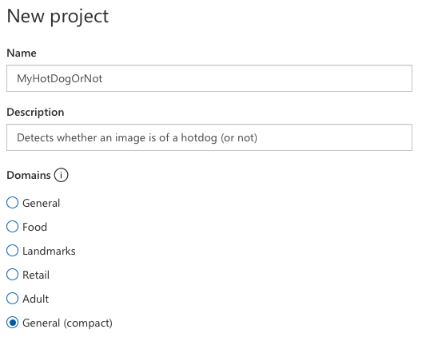
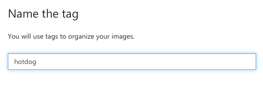
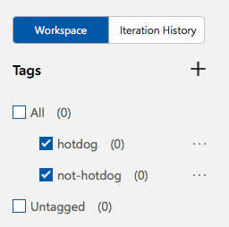
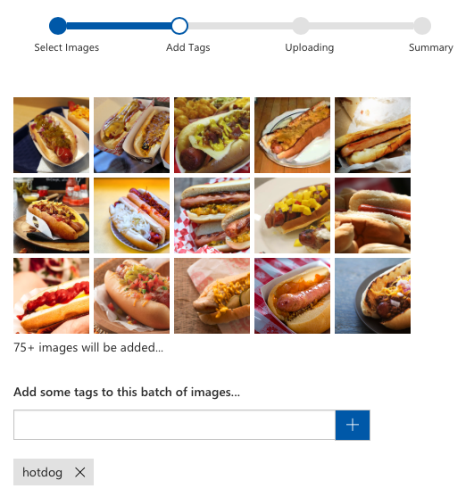
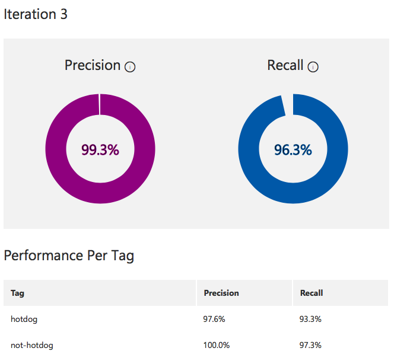
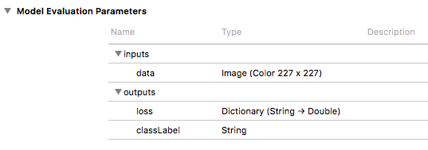
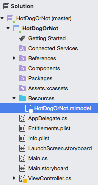
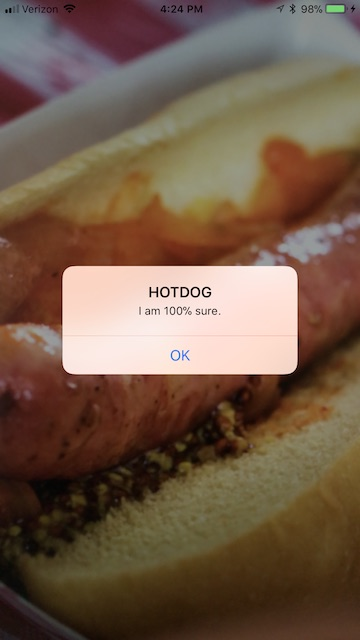

# "Hotdog or Not" Using Azure Custom Vision, CoreML, and Xamarin

**TL;DR** I used Microsoft's Custom Vision service to train a CoreML model and wrote an iOS app in Xamarin to execute it in less than two hours. It has a loose tie-in with a popular television show. [Code on GitHub](https://github.com/praeclarum/HotDogOrNot)


## Machine Learning Is Easy Now?


Microsoft released a webapp called [Custom Vision](https://www.customvision.ai) as a part of their Azure Cognitive Services. While Microsoft has been a player in machine learning for awhile now with all their offerings, this new service is special for one reason: it can export CoreML models.

CoreML is a new feature of iOS 11 that enables apps to execute neural networks (and other ML models) locally on the device. While this has always been possible, **Apple made execution *easy*.**

All you need is a trained model and all of a sudden your app can do some fancy AI tricks - all locally without needing a network connection and without sharing information with third parties.

The only trick is that you need to train a model. While there are certainly pre-trained models online that you can download, chances are they won't do exactly what you want.

To train a CoreML model, you would follow the Keras tutorials and examples. Keras, while amazingly powerful, is neither easy to learn nor easy to use even once you've learned it. Eventually your skills increase and you can use it, but it does take quite some effort. It also takes some money - training deep networks is slow on standard PC hardware. Soon you'll be buying fast GPUs or paying for virtual machines out in the cloud.

Now with Custom Vision, **Microsoft has made training *easy*.** Instead of learning Keras and finding some fast GPUs to run it on, you can just use Microsoft's web app. They use Azure's infrastructure to find machines and, most importantly, they don't require that you learn how to train networks manually. Instead, there is a GUI that holds your hand, lets you experiment, and keeps everything organized for you.

In this version, they made training easy only for a particular kind of model: **recognizing the dominant object in a scene**. This is a classic task for CNN based neural networks to solve because they're really good at it and it's a useful capability with numerous real-world applications. It's a great choice for Microsoft to lead with this type of model.

So that's the hype. But does it work?

I tried training a new model and writing app to execute it to find out. Since I wasn't confident in my success (and perhaps had too many beers while extolling the virtues of ML to friends), I decided to make it an easy problem: **hot dog or not**. The app would take a picture and decide if the dominant object in the scene is a hotdog. Yes mom and dad, I'm really putting my degree to use.

I wrote my experience below as a tutorial for doing these kinds of trainings yourself. If you follow along, you'll be able to write an iOS ML app yourself.


## Step 1. Gather Training Data

No matter how skilled you are as a data scientist you will always be terrible at one thing - gathering training data.

We need two sets of images to train our model: one set of hotdogs and another of *not* hotdogs.

Sounds easy right? Well sure it is until you start actually doing it. Quickly you'll run up against questions and troubling biases:

1. Is a drawing of a hotdog a hotdog? (Aristotle would be proud.)
2. Are two hotdogs a hotdog? (What about 3?)
3. Should I have an equal number of hotdogs with mustard as hotdogs with ketchup? (Should you bias the network towards your *a priori* view of the world? Are your biases personal or universal?)
4. Should I have an equal number of images of hotdogs and not hotdogs? (Since nearly all objects in the universe are not hotdogs, just how strong should our bias be?)
5. Why do people dress up their dogs as hotdogs?

The list goes on and on. You will confront your biases when collecting training data. Those biases will then be passed onto the network you train. You've been warned.

Thankfully the nature of this app precludes the need to do much soul searching for biases towards hotdogs. So I made some executive decisions:

1. No, drawings are not hotdogs
2. Yes, many hotdogs are a hotdog
3. Bias towards ketchup because it's better
4. Bias towards not hotdogs since people love to try to trick these kinds of apps
5. Just accept it

Data collection takes a long time too even with Google's assistance. After an hour of dragging and dropping, I ended up with **75 images of hotdogs and 175 images of not hotdogs**. (I could have written a script but we all know how deep that rabbit hole is.)

For anyone who's trained a CNN before, you know that this is a very small training set. Even more absurdly, Custom Vision only **requires 5 images** of each type. What's going on here?

While Microsoft doesn't explain the details, my guess is that they are **fine-tuning** a model already trained on images. The idea is that you take a trained model and then re-train only a part of it on new data. The hope is that the majority of the model is general purpose and can be reused. This saves training time and also reduces the required training set size. I'm not sure if this is what they're doing, but I'm relieved that I don't have to gather tens of thousands of images.

Of course with all ML, more data is better. But my fingers were getting tired. (Also, Custom Vision is currently capped at 1,000 training images.)

## Step 2. Create a Project

You will want a project for each network you train. Projects hold all of your images and your trained models. You will end up training multiple times because it's good to experiment with different training set sizes and compositions.

1. Create an account on [https://www.customvision.ai](https://www.customvision.ai). It's free!
2. Create a **New Project**.



I named the project **MyHotDogOrNot**, gave it a banal description, and then chose the domain **General (compact)**.

Domains are starting points for your trained model. If you are using cognitive services as a web API, then you should choose whichever domain most closely matches your training data.

General (compact) is the only domain that supports CoreML export so we must choose that. Hopefully Microsoft will allow us to use the other domains in the future in order to improve accuracy.


## Step 3. Create Tags

When you're viewing your project, you will see a list of tags. We need to make this list match the types of training images gathered. 

1. Click the **+** at the top of the **Tags** list.
2. Create two tags: **hotdog** and **not-hotdog**.



When you're done, you'll see a list of your tags. The (0) means there are no images yet associated with the tags.




## Step 4. Upload Training Data

You can upload all the images with the same tag using just one command.

1. Choose **Add images** from the toolbar and select all of your hotdog images.
2. Add the tag **hotdog**.
3. Click **Upload files**.
4. Repeat for the tag **not-hotdog**.




## Step 5. Train the Model

So let's train this thing already.

1. Click the big green **Train** button.
2. Go to the **Performance** tab and wait for your "Iteration" to finish.



When training is complete you will see the performance screen with the overall Precision and Recall of the model. In my case, I get slightly better results detecting not-hotdog than hotdog but they're both great numbers so why fret.

Of course, these numbers don't mean your network will work in the real world since the performance is measured against images you hand selected (with all your gross human biases). That said, you can use them as rough indicators of the relative performance of one training iteration against another.


## Step 6. Export the CoreML Model

Finally, we can retrieve the CoreML file.

1. Click **Export** from your iteration's performance screen.
2. Choose **iOS 11 (CoreML)** from the platform selection screen.
3. Click **Export**.
4. Click **Download**.

You will now have a fancy **.mlmodel** model file. Rename it to something nice.

If you open it with Xcode you will see its inputs and outputs.



We can see that its input is a 227 x 227 pixel image named **data** and its output includes a **classLabel** string that will be the model's best judgement and also a **loss** output that will give a closeness measure for each of our tags.


## Step 7. Write an App

At this point we have a model file and just need to put a UI on it.

To keep the code to a minimum, I'm going to use the **Vision** framework to execute the CoreML model. This framework makes resizing images to our required 227x227 dimensions easy and also takes care of numerical and pixel format conversions.

I will also use ARKit to display the camera on the screen. This is most definitely overkill, but it greatly reduces the amount of code we need to write to deal with the camera.

First, create a new Single View app.


Modify `ViewController.cs` to add an AR view.

```csharp
// In ViewController
readonly ARSCNView cameraView = new ARSCNView ();
public override void ViewDidLoad ()
{
    base.ViewDidLoad ();
    cameraView.Frame = View.Bounds;
    cameraView.AutoresizingMask = UIViewAutoresizing.FlexibleDimensions;
    View.AddSubview (cameraView);
}
```

Perform the standard management of that view. This is all we need to get a live camera preview.

```csharp
// In ViewController
public override void ViewWillAppear (bool animated)
{
    base.ViewWillAppear (animated);
    var config = new ARWorldTrackingConfiguration {
        WorldAlignment = ARWorldAlignment.Gravity,
    };
    cameraView.Session.Run (config, (ARSessionRunOptions)0);
}

public override void ViewWillDisappear (bool animated)
{
    base.ViewWillDisappear (animated);
    cameraView.Session.Pause ();
}
```

Add the model to the resources section of your app.



Add code to load the model. Models need to be compiled before they can be loaded. If you have access to Xcode, you can pre-compile your models. Compiling on the device is pretty fast so we won't bother with that optimization. (I do this loading in the view controller's `ViewDidLoad` method but you should architect your app better by doing this work on a background task.)

This also includes code to initialize the Vision request that we will make. Requests can be used for multiple images so we initialize it once. When a request completes, `HandleVNRequest` will be called.

```csharp
// In ViewController
MLModel model;
VNCoreMLRequest classificationRequest;

// In ViewController.ViewDidLoad ()
var modelUrl = NSBundle.MainBundle.GetUrlForResource (
    "HotDogOrNot", "mlmodel");
var compiledModelUrl = MLModel.CompileModel (modelUrl, out var error);
if (error == null) {
    model = MLModel.Create (compiledModelUrl, out error);
    if (error == null) {
        var nvModel = VNCoreMLModel.FromMLModel (model, out error);
        if (error == null) {
            classificationRequest = new VNCoreMLRequest (nvModel, HandleVNRequest);
        }
    }
}
```

Add a tap handler that will respond to any taps on the screen (I like simple UIs). When a tap is detected, the Vision framework will be used to perform the model execution.

```csharp
// In ViewController.ViewDidLoad ()
cameraView.AddGestureRecognizer (new UITapGestureRecognizer (HandleTapped));

// In ViewController
void HandleTapped ()
{
    var image = cameraView.Session?.CurrentFrame?.CapturedImage;
    if (image == null) return;

    var handler = new VNImageRequestHandler (image, CGImagePropertyOrientation.Up, new VNImageOptions ());

    Task.Run (() => {
        handler.Perform (new[] { classificationRequest }, out var error);
    });
}

void HandleVNRequest (VNRequest request, NSError error)
{
    if (error != null) return;
	
    var observations =
        request.GetResults<VNClassificationObservation> ()
               .OrderByDescending (x => x.Confidence);

    ShowObservation (observations.First ());
}

```

Finally, in `ShowObervation` we present an alert of the model's best guess.

```csharp
// In ViewController
void ShowObservation (VNClassificationObservation observation)
{
    var good = observation.Confidence > 0.9;
    var name = observation.Identifier.Replace ('-', ' ');
    var title = good ? $"{name}" : $"maybe {name}";
    var message = $"I am {Math.Round (observation.Confidence * 100)}% sure.";

    BeginInvokeOnMainThread (() => {
        var alert = UIAlertController.Create (title, message, UIAlertControllerStyle.Alert);
        alert.AddAction (UIAlertAction.Create ("OK", UIAlertActionStyle.Default, _ => { }));
        PresentViewController (alert, true, null);
    });
}
```

And that's it, we now have an app that can detect hot dogs (or not)!



You can find the [complete source code on GitHub](https://github.com/praeclarum/HotDogOrNot).


## Conclusion

It's great to see Microsoft and Apple technologies working together to make adding a powerful feature to apps easier. If you made it this far, you saw how I was able to build the app in less than two hours and I think you can see that it's pretty easy to make your own ML apps.
